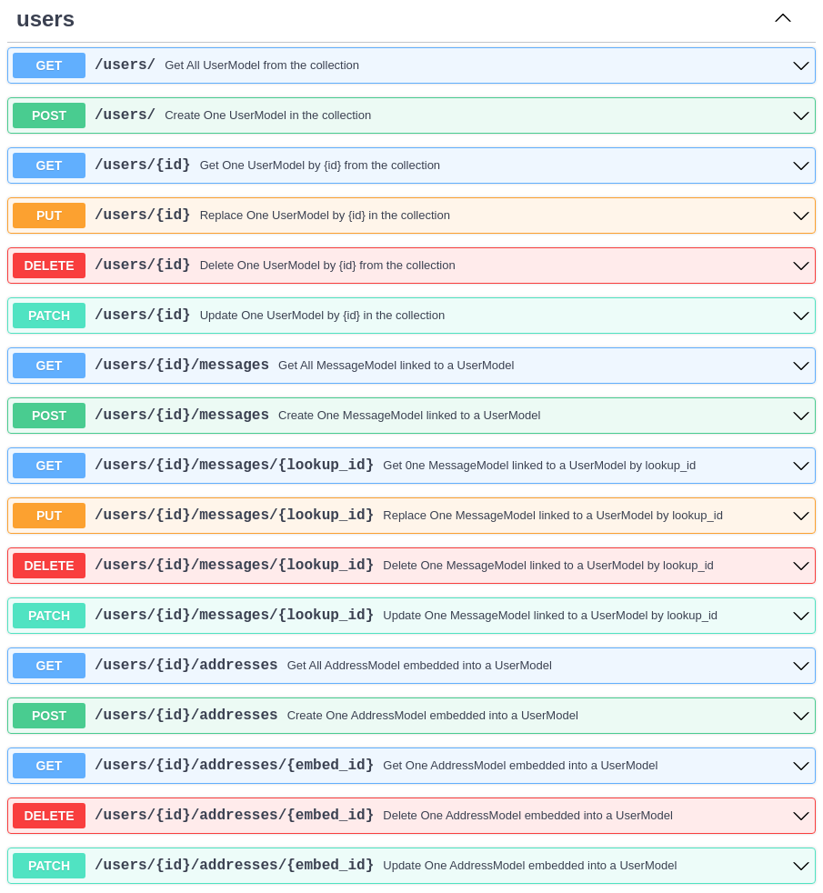

<p align="center">
  
</p>
<p align="center">
  <em>⚡ Create CRUD routes with lighting speed</em> ⚡</br>
  <sub>A dynamic FastAPI router that automatically creates CRUD routes for your Mongodb models</sub>
</p>

---

**Documentation**: [https://pierrod.github.io/fastapi-crudrouter-mongodb-doc/](https://pierrod.github.io/fastapi-crudrouter-mongodb-doc/)

**Source Code**: [https://github.com/pierrod/fastapi-crudrouter-mongodb](https://github.com/pierrod/fastapi-crudrouter-mongodb)

**Credits** :

- Base projet and idea : [awtkns](https://github.com/awtkns/fastapi-crudrouter)

- Convert \_id to id : [mclate github guide](https://github.com/tiangolo/fastapi/issues/1515)

---

Tired of rewriting generic CRUD routes? Need to rapidly prototype a feature for a presentation
or a hackathon? Thankfully, [fastapi-crudrouter-mongodb](https://pierrod.github.io/fastapi-crudrouter-mongodb-doc/) has your back.

As an extension to the APIRouter included with [FastAPI](https://fastapi.tiangolo.com/), the FastAPI CRUDRouter will automatically
generate and document your CRUD routes for you, all you have to do is pass your model and maybe your database connection.

## Installation

```bash
pip install fastapi-crudrouter-mongodb
```

## Basic Usage

I will provide more examples in the future, but for now, here is a basic example of how to use the FastAPI CRUDRouter for Mongodb.

```python
from datetime import datetime
from typing import List, Optional, Union
from fastapi import FastAPI
from pydantic import Field
from fastapi_crudrouter_mongodb import CRUDRouter, MongoModel, MongoObjectId, CRUDLookup
import motor.motor_asyncio


# Database connection using motor
client = motor.motor_asyncio.AsyncIOMotorClient(
    "mongodb://localhost:27017/local")

db = client.local

# Models
class MessageModel(MongoModel):
    id: Optional[MongoObjectId] = Field()
    message: str
    user_id: MongoObjectId
    created_at: Optional[str] = datetime.now().strftime("%Y-%m-%d %H:%M:%S")
    updated_at: Optional[str] = datetime.now().strftime("%Y-%m-%d %H:%M:%S")

class AddressModel(MongoModel):
    id: Optional[MongoObjectId] = Field()
    street: str
    city: str
    state: str
    zip: str

class UserModel(MongoModel):
    id: Optional[MongoObjectId] = Field()
    name: str
    email: str
    addresses: Optional[List[AddressModel]]
    messages: Optional[Union[List[MessageModel], MessageModel]] = None


# Instantiating the CRUDRouter, and a lookup for the messages
# a User is a model that contains a list of embedded addresses and related to multiple messages
messages_lookup = CRUDLookup(
        model=MessageModel,
        collection_name="messages",
        prefix="messages",
        local_field="_id",
        foreign_field="user_id"
    )

users_controller = CRUDRouter(
    model=UserModel,
    db=db,
    collection_name="users",
    lookups=[messages_lookup],
    prefix="/users",
    tags=["users"],
)

# Instantiating the FastAPI app
app = FastAPI()
app.include_router(users_controller)
```

## OpenAPI Support

By default, all routes generated by the CRUDRouter will be documented according to OpenAPI spec.

Below are the default routes created by the CRUDRouter shown in the generated OpenAPI documentation.


