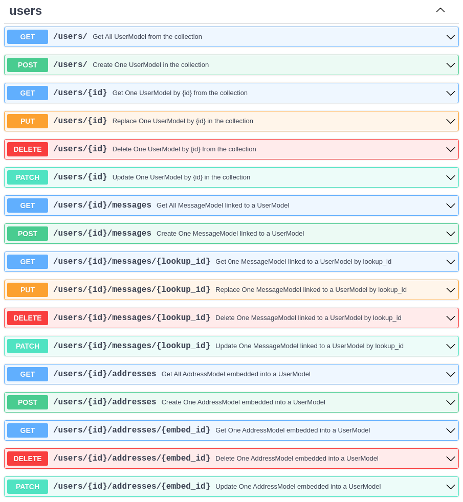

This is a minimalist example of a FastAPI application build with FastAPI CRUDRouter for Mongodb :seedling:.

I'm working on differents examples, with some custom router besides the CRUDRouter, and I will add them to the documentation soon :rocket:.

```py linenums="1"
from datetime import datetime
from typing import List, Optional, Union
from fastapi import FastAPI
from pydantic import Field
from fastapi_crudrouter_mongodb import CRUDRouter, MongoModel, MongoObjectId, CRUDLookup
import motor.motor_asyncio


# Database connection using motor
client = motor.motor_asyncio.AsyncIOMotorClient(
    "mongodb://localhost:27017/local")

db = client.local

# Models
class MessageModel(MongoModel):
    id: Optional[MongoObjectId] = Field()
    message: str
    user_id: MongoObjectId
    created_at: Optional[str] = datetime.now().strftime("%Y-%m-%d %H:%M:%S")
    updated_at: Optional[str] = datetime.now().strftime("%Y-%m-%d %H:%M:%S")

class AddressModel(MongoModel):
    id: Optional[MongoObjectId] = Field()
    street: str
    city: str
    state: str
    zip: str

class UserModel(MongoModel):
    id: Optional[MongoObjectId] = Field()
    name: str
    email: str
    addresses: Optional[List[AddressModel]]
    messages: Optional[Union[List[MessageModel], MessageModel]] = None


# Instantiating the CRUDRouter, and a lookup for the messages
# a User is a model that contains a list of embedded addresses and related to multiple messages
messages_lookup = CRUDLookup(
        model=MessageModel,
        collection_name="messages",
        prefix="messages",
        local_field="_id",
        foreign_field="user_id"
    )

users_controller = CRUDRouter(
    model=UserModel,
    db=db,
    collection_name="users",
    lookups=[messages_lookup],
    prefix="/users",
    tags=["users"],
)

# Instantiating the FastAPI app
app = FastAPI()
app.include_router(users_controller)
```

It will give you the following OpenAPI schema:



