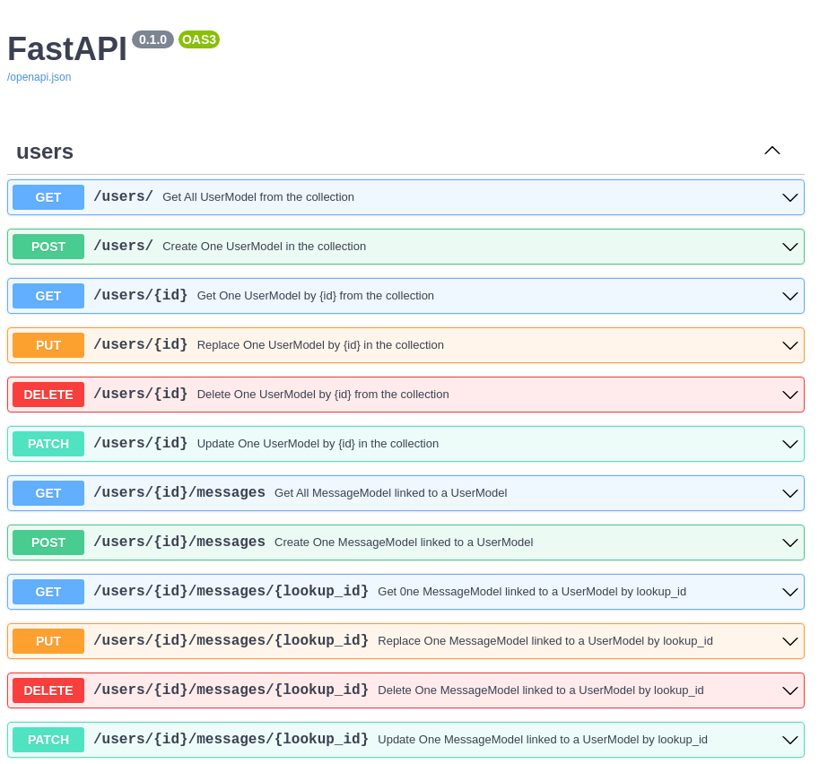

The CRUDLookup wasn't easy to implement, but it is now working like a charm :sparkles: (or kinda actually, I'm not really satisfied on how it's working).

You can't define your 'lookup' relation directly inside your model, and I'm really sorry about that, but it's the only way I found to make it work for the moment.

I'm still working on it, and I hope to find a better way to do it, but for now, it's working :sweat_smile:.

!!! question "How to use it ?"
    The parent model should have a field with an `Union` type, which means that it should look like below :


    ```py hl_lines="4"

    # Parent
    class ParentModel(MongoModel):
        id: Optional[MongoObjectId] = Field()
        childs: Optional[Union[List[ChildModel], ChildModel]] = None

    # Child
    class ChildModel(MongoModel):
        id: Optional[MongoObjectId] = Field()
        parent_id: MongoObjectId

    ```

    Then, you can define your lookup like this :

    ```py hl_lines="4 5 6 7 8 9 10"

    from fastapi_crudrouter_mongodb import CRUDLookup
    
    # Define your lookup
    child_lookup = CRUDLookup(
        model=ChildModel,
        collection_name="childrens",
        prefix="childrens",
        local_field="_id",
        foreign_field="parent_id"
    )

    # Then, you can use it in your CRUDRouter
    parent_controller = CRUDRouter(
        model=ParentModel,
        db=db,
        collection_name="parents",
        lookups=[child_lookup],
        prefix="/parents",
        tags=["parents"],
    )

    ```

The type should look like above because if you want to use the following route : `/parents/{id}/childrens/{id}` , it will return the child item as an object an not a list.

The CRUDRouter will automatically build the following routes :

| Route | Method | Description |
| --- | --- | --- |
| `/parents` | `GET` | Get all documents |
| `/parents` | `POST` | Create a new document |
| `/parents/{id}` | `GET` | Get a document by id |
| `/parents/{id}` | `PUT` | Update a document by id |
| `/parents/{id}` | `DELETE` | Delete a document by id |
| `/parents/{id}/childrens` | `GET` | Get all childrens of a parent |
| `/parents/{id}/childrens/{lookup_id}` | `GET` | Get a child of a parent by id |
| `/parents/{id}/childrens` | `POST` | Create a new child document |
| `/parents/{id}/childrens/{lookup_id}` | `PUT` | Replace a child document by id and lookup_id |
| `/parents/{id}/childrens/{lookup_id}` | `PATCH` | Update a child document by id and lookup_id |
| `/parents/{id}/childrens/{lookup_id}` | `DELETE` | Delete a document by id |

!!! note "If you want to respect the RESTfull"
    Make sure to add an `s` to the end of prefix, so that the route will be `/childrens` instead of `/children` (which is not correct, I know, but you see the point here :wink:).

The CRUDRouter will also generate the OpenAPI schema for you, and document the routes for you.



If you are looking for a way to make the CRUDRouter work with an `embed` model, don't worry I got your back :muscle:.

[http://localhost:8000/features/CRUDEmbed](http://localhost:8000/features/CRUDEmbed)