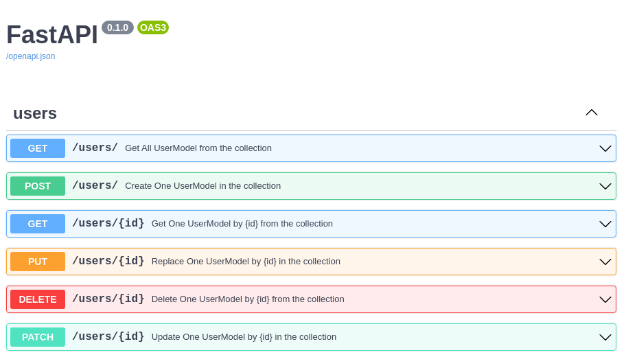

The CRUDRouter is able to generate and document your routes based on the mongo model you pass to it.


```python
CRUDRouter(
    model=MyMongoModel,
    db=MyDbInstance,
    collection_name="my_collection_name",
    lookups=[MyFirstLookup, MySecondLookup],
    prefix="/my_prefix",
)
```


As the CRUDRouter herits from the APIRouter, you can pass all the parameters you would pass to the APIRouter, such as `prefix`, `tags`, `dependencies` etc.

The CRUDRouter will generate the following routes for you:

| Route | Method | Description |
| --- | --- | --- |
| `/my_prefix` | `GET` | Get all documents |
| `/my_prefix` | `POST` | Create a new document |
| `/my_prefix/{id}` | `GET` | Get a document by id |
| `/my_prefix/{id}` | `PUT` | Replace a document by id |
| `/my_prefix/{id}` | `PATCH` | Update a document by id |
| `/my_prefix/{id}` | `DELETE` | Delete a document by id |

!!! note "If you want to respect the RESTfull"
    Make sure to add an `s` to the end of prefix, so that the route will be `/my_prefixes` instead of `/my_prefix`.


The CRUDRouter will also generate the OpenAPI schema for you, and document the routes for you.



You might want to do some relational stuff in your fastapi app, and you might want to use the CRUDRouter to generate your routes. Insane news, the CRUDRouter is able to generate routes for you based on your mongo model, and it is able to generate the OpenAPI schema for you.

You will find more information about the CRUDRouter in the following page.

[http://localhost:8000/features/CRUDLookup](http://localhost:8000/features/CRUDLookup)

If you aren't looking for the "lookup" stuff, but for a way to use an embed model, you can find more information about the CRUDEmbed in the following page.

[http://localhost:8000/features/CRUDEmbed](http://localhost:8000/features/CRUDEmbed)