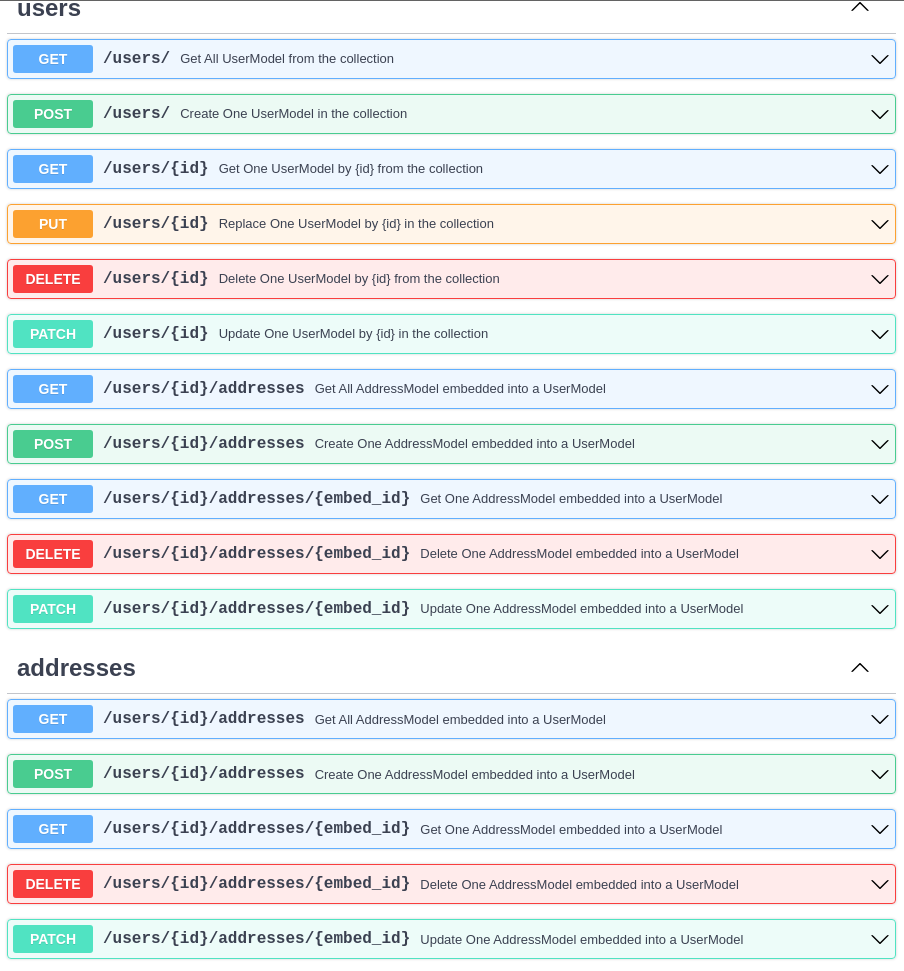

The CRUDEmbed is the latest element I added to the CRUDRouter. It allows you to embed a model in another model. It's a bit like the lookup, but it's not the same. It's used to store a list of element inside your first model into the collection. It's a bit like a one-to-many relation.

I'm currently working on adding the Update and Replace methods to the CRUDEmbed, and I'm also working on the documentation. I hope to be able to release a new version soon :rocket:.

The Delete method is available but also kinda different from the rest in it returns.

!!! question "How to use it ?"
CRUDRouter will detect that a field is a list of MongoModel and use it to build an embed around it.

    ```py hl_lines="4"
    ...
    class MyModel(MongoModel):
        id: Optional[MongoObjectId] = Field()
        embeds: Optional[List[EmbedModel]]

    ```

The prefix of the CRUD routes will be the name of the field, in this case, it will be `embeds`.

The CRUDRouter will automatically add the following routes to the parent model :

| Route          | Method   | Description             |
| -------------- | -------- | ----------------------- |
| `/embeds`      | `GET`    | Get all documents       |
| `/embeds`      | `POST`   | Create a new document   |
| `/embeds/{id}` | `GET`    | Get a document by id    |
| `/embeds/{id}` | `PUT`    | Update a document by id |
| `/embeds/{id}` | `DELETE` | Delete a document by id |

But it will also add the routes above to the embed model OpenAPI schema.


